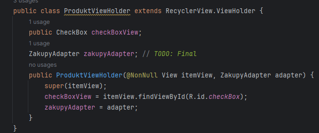
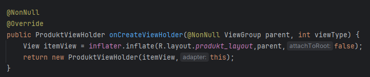
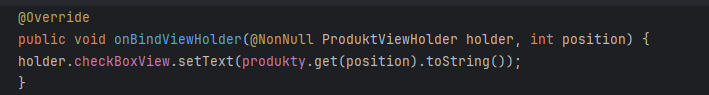
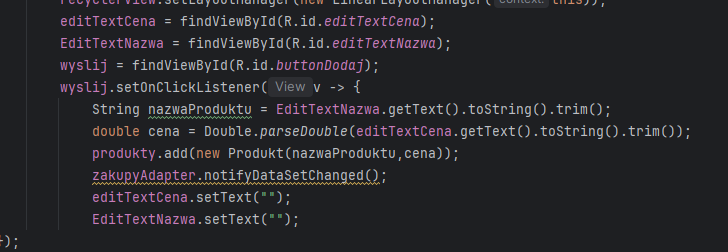

## ♻️ RECYCLER VIEW

- 🏛️ dodajemy nowa klase  
- 📁 res -> layout -> new resource file(nazywamy produkt_layout)
- 🆕 dodajemy elementy, i robimy wyglad w tym pliku
- ☮️ teraz mainactivty, dodajemy elementy(recycler view ♻️) i uporzadkujemy to
- 🛍️ Teraz dodajemy ZakupyAdapter

CreateClass:
```java
public class ZakupyAdapter extends RecyclerView.Adapter<ZakupyAdapter.ProduktViewHolder>
```
Teraz pod tym wpisujemy oraz klikamy ShowContextAction:
```java
public class ProduktViewHolder extends RecyclerView.ViewHolder
```
Teraz klikamy zakupyAdapter i implement method, mają być pobrane 3 metody (onCreateViewHolder, onBindViewHolder, getItemCount).
Teraz mają być klasy, które ma adapter zapamiętać, wprowadzamy:
```java
private ArrayList<Produkt> produkty;
```
Dodajemy:
```java
private LayoutInflater inflater;
```
Generujemy konstruktor dla listy produktów; w konstruktorze przyjmujemy Context i inicjalizujemy inflater:
```java
public ZakupyAdapter(Context context, ArrayList<Produkt> produkty) {
    this.produkty = produkty;
    this.inflater = LayoutInflater.from(context);
}
```

- 📦 Teraz w ProduktViewHolder dodajemy CheckBox oraz ZakupyAdapter

- 🔙 W getItemCount robimy ``return produkty.size()``
- 🤔 Teraz w ProduktViewHolder<br>

- 🖼️ Teraz w onBindViewHolder robimy tak

<br>, oraz nalezy
synchronizowac stan przy odswiezaniu listy ``holder.checkBoxView.setChecked(produkty.get(position).isCzyKupione());``
- 📘 W MainActivty dodajemy arraylist zakupyAdapter oraz recyclerView i dodajemy wartosci(POZA ONSTART)(Pamietaj aby pobrac recyclerview)
- ⚛️ Teraz robimy dodawanie nowego elementu

- ✨ Teraz na klikniecie, ale wpierw w ZakupyAdapter dodajemy ``implements View.OnClickListener``(dodajemy to po extends) a nastepnie importujemy metode ``OnClick``
- 👆 W tym [OnClick](), trzeba dodac ``checkBoxView.setOnClickListener(this)``
- 🗑️ I usuwamy ``produkty.get(ktoryProdukt).setCzyKupione(true);`` bo to ***zawsze true ustawia***
- 💃 Teraz dodajemy button w mainactivty do usuwania calosci i wprowadzamy ten kod w mainactivity
```java
   buttonUsun.setOnClickListener(v -> {
            zakupyAdapter.usunZaznaczone();
        });
```
- 🛍️ A w zakupyAdapter wprowadzamy
```java
  public void usunZaznaczone(){
       produkty.removeIf(produkt -> produkt.isCzyKupione());
       notifyDataSetChanged();
    }
```

---

👑 F4Mythical
